# ДЗ1 по курсу "Обеспечение качества ПО"
Команда Кайрос: Валова София, Богдан Новиков 
Сайт: [resto-go.site](http://resto-go.site) 
Тестовое окружение: Google Chrome 40+ 

По всему сайту не загружаются картинки, вместо них плейсхолдеры (**БАГ**)

## 1. Регистрация, авторизация
[Регистрация](https://resto-go.site/signup) 
[Авторизация](https://resto-go.site/signin)

_Позитивные тесты_ 

Регистрация:
1. Заполнить поля формы (имя 2-19 символов, почта имеет имя ящика, собачку и домен, пароль содержит цифры и латинские буквы, минимум 8 символов) и нажать на кнопку "Зарегистрироваться"  - редирект на [главную страницу](https://resto-go.site/restaurants)
2. Нажать на кнопку "Войти" - редирект на страницу [авторизации](https://resto-go.site/signin)
   
Авторизация:
1. Заполнить поля формы (почта имеет имя ящика, собачку и домен, пароль содержит цифры и латинские буквы, минимум 8 символов) и нажать на кнопку "Войти"  - редирект на главную страницу, в правом верхнем углу отображается аватарка
2. Нажать на кнопку "Зарегистрироваться" - редирект на страницу [регистрации](https://resto-go.site/signup)

Общие:
1. Ввести в поле с глазиком данные, нажать на глазик - отобразится скрытое содержимое
2. Нажать на глазик - содержимое скроется точками
3. Нажать на кнопку "На главную" - редирект на [главную страницу](https://resto-go.site/restaurants)
4. Если переход на эту страницу произошел не по ссылке, а с другой страницы, то будет кнопка "Назад", нажать на нее - редирект на предыдущую страницу

_Негативные тесты_ 
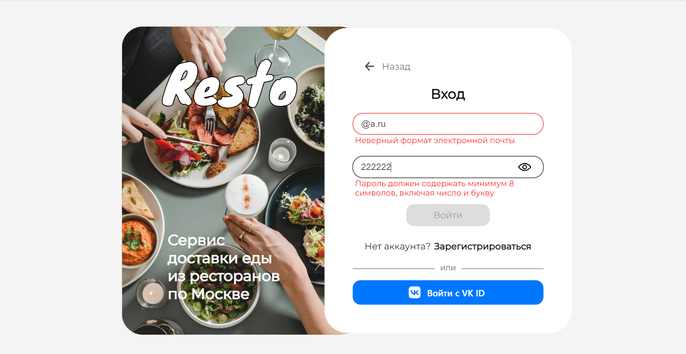
1. Ввести пароль из русских букв  - появятся требования к паролю
2. Ввести пароль меньше 8 символов - появятся требования к паролю
3. Ввести пароль только из цифр - появятся требования к паролю
4. Ввести пароль только из английских букв - появятся требования к паролю
5. Ввести имя из одной буквы - отобразятся требования к имени (для регистрации)
6. Ввести имя больше, чем из 19 букв - отобразятся требования к имени (для регистрации)
7. Ввести почту без собачки - вывод сообщения с требованием к почте
8. Ввести почту без домена - вывод сообщения с требованием к почте
9. Ввести почту без имени ящика - вывод сообщения с требованием к почте
10. Ввести неверную почту и нажать на кнопку "Войти" - отобразится сообщение о неверном пароле или логине (для авторизации)
11. Ввести неверный пароль и нажать на кнопку "Войти" - отобразится сообщение о неверном пароле или логине (для авторизации)
12. Ввести почту, под которой вы уже регистрировались, заполнить остальные поля, нажать "Зарегистрироваться" - отобразится сообщение о сущестовании пользователя с таким логином
13. Убрать значения из всех полей - появится сообщение, что поля не могут быть пустыми
14. Нажать на кнопку "Войти с VK ID" -> в форме ввести номер телефона и нажать на кнопку "Продолжить" -> нажать на надпись "Отправьте другим способом" -> следовать инструкции (отправится код на почту или в sms-сообщении), ввести код в форму -> ввести пароль от аккаунта в вк, нажать на кнопку "Продолжить" - страница с белым фоном, в левом верхнем углу написано "Network error happend" (**БАГ**)

## 2. Верхняя панель 
Доступна со всех страниц, кроме авторизации и регистрации. Рассмотрим ее на [главная странице](https://resto-go.site/restaurants) 

_Позитивные тесты_ 

1. У неавтаризированного пользователя отображается справа сверху кнопка "Войти", нажать на нее - редирект на страницу [авторизации](https://resto-go.site/signin)
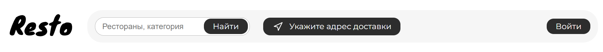
2. У авторизированного пользователя отображается справа сверху его аватарка.
3. Авторизоваться, нажать на аватарку - появится выпадающий список с именем пользователя и разделами: "Профиль", "Заказы", "Корзина", "Выйти"
4. Нажать на "Профиль" - редирект на страницу [профиля](https://resto-go.site/profile)
5. Нажать на логотип Resto - редирект на [главную страницу](https://resto-go.site/restaurants)
6. Нажать на "Заказы" - редирект на страницу со [историей заказов](https://resto-go.site/orders)
7. Нажать на "Корзина" - редирект на страницу [корзины](https://resto-go.site/cart)
8. Нажать на "Выйти" - отобразится сообщение, что ждем пользователя снова, вместо аватарки появится кнопка "Войти"
9. Ввести в поле поиска название ресторана, нажать на кнопку "Найти" - появится список ресторанов (картинка, название, категории), у которых в названии есть введеное значение
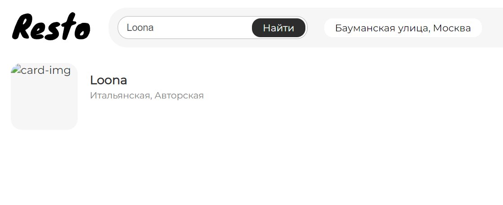
10. Ввести в поле поиска название категории ресторана, нажать на кнопку "Найти" - появится список ресторанов (картинка, название, категории), у которых в названии категории есть введеное значение
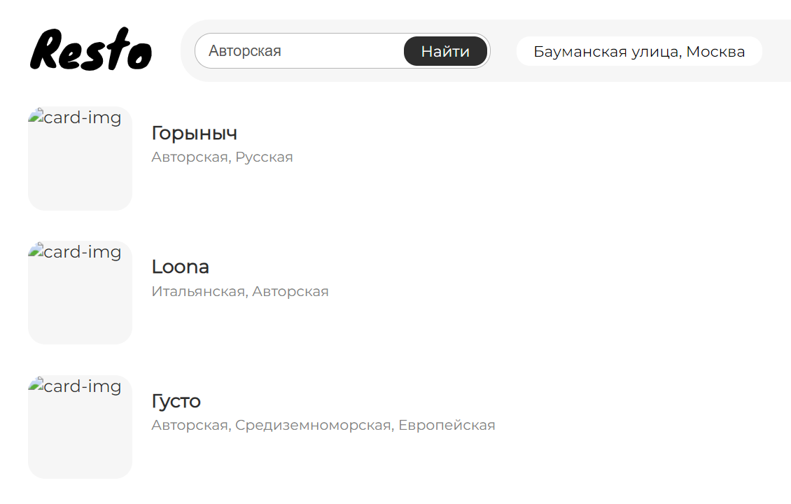
11. Нажать на кнопку "Указать адрес" -> откроется модальное окно -> ввести адрес -> нажать на кнопку "Сохранить" - окно закроется, на месте кнопки "Указать адрес" появится адрес
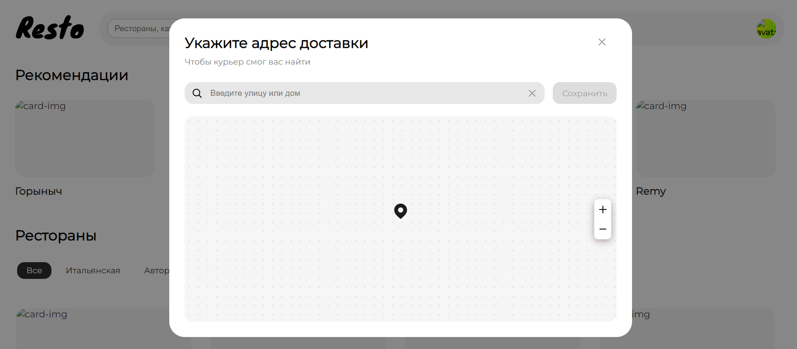
12. Корзина пуста -> на главной странице нажать на любой ресторан -> на странице ресторана на карточке блюда нажать кнопку "Добавить" - в панели появится кнопка корзины с суммой корзины

13. Нажать на кнопку с иконкой корзины - редирект на [страницу корзины](https://resto-go.site/cart)

_Негативные тесты_ 
1. С пустой поисковой строкой нажать на «Найти» - ничего не произойдет
2. Если ресторана нет - выведется "Ничего не найдено"
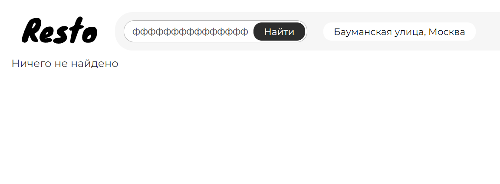

## 3. Главная страница
[Главная страница](https://resto-go.site/restaurants) 

1. Нажать на категорию - отобразятся рестораны данной категории
2. Нажать на карточку ресторана  - редирект на страницу ресторана
3. Проскролить страницу вниз - верхняя панель закрепляется сверху
4. Нажать на карточку ресторана, на карточке блюда нажать на кнопку "Добавить", нажать на кнопку корзины, в форме ввода указать квартиру, подъезд и этаж, нажать на кнопку "Заказать" - появится карточка со статусом заказа, названием ресторана, временем доставки и кнопкой
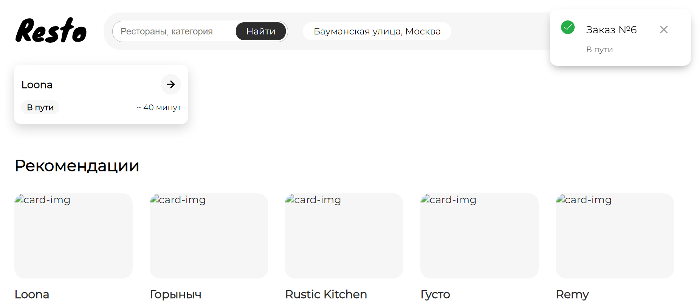
5. Нажать на кнопку со стрелочкой на карточке - редирект на страницу заказа
6. Нажать на карточку ресторана из рекомендаций - редирект на страницу этого ресторана

## 4. Страница ресторана
[Ресторан Горыныч](https://resto-go.site/restaurants/1) 
_Позитивные тесты_ 

1. Проскроллить вниз - левая панель зафиксирована на своем месте
2. Нажать на левой панели на категорию - страница пролистывается до нее
3. Корзина пуста, нажать на кнопку "Добавить" на карточке блюда - появляется кнопка корзины с суммой, вместо кнопки "Добавить" появляется `- <кол-во блюд> +`
4. Корзина наполнена, нажать на кнопку "Добавить" на карточке блюда - увеличивается сумма корзины на стоимость блюда, вместо кнопки "Добавить" появляется `- <кол-во блюд> +`
5. Нажать на `-`/`+` - сумма корзины уменьшится/увеличится, изменяется число количества блюда
6. Блюдо в одном экземпляре в корзине, нажать на "-" на его карточке - сумма корзины уменьшится на стоимость блюда, `-<кол-во блюд>+` поменяется на "Добавить"
7. Нажать на "Отзывы" (под описанием ресторана) - откроется модальное окно с отзывами пользователей на этот ресторан
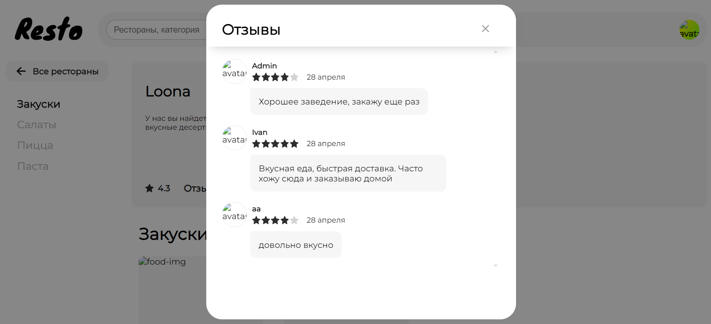
8. Добавить блюда в корзину -> перейти на страницу другого ресторана -> нажать на кнопку "Добавить" - появится модальное окно с выбором: стереть корзину и добавить это блюдо или не добавлять блюдо
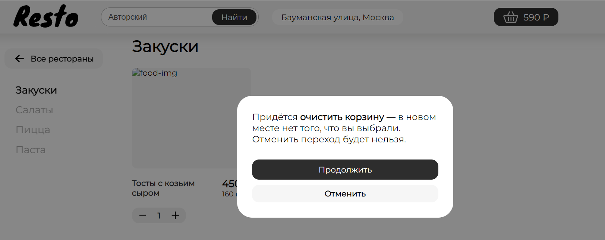
9. Добавить блюда в корзину -> перейти на страницу другого ресторана, нажать на кнопку "Добавить" -> в появившемся модальном окне нажать "Продолжить" - сумма корзины станет равной стоимости блюда из этого ресторана
10. Добавить блюда в корзину -> перейти на страницу другого ресторана, нажать на кнопку "Добавить" -> в появившемся модальном окне нажать "Отменить" - сумма корзины не изменится
11. Нажать на кнопку "Все рестораны" - редирект на [главную страницу](https://resto-go.site/restaurants)

_Негативные тесты_ 
1. Добавить 99 блюд  - кнопка `+` станет недоступной для клика

## 5. Корзина
[Корзина](https://resto-go.site/cart) 
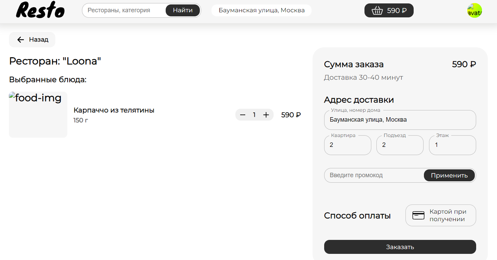
_Позитивные тесты_ 

1. Нажать на кнопку "Назад" - редирект на предыдущую страницу
2. Нажать на `-`/`+` у блюда - сумма корзины уменьшится/увеличится, изменяется число количества блюда
3. Оставить блюдо в одном экземпляре, нажать на `-` - блюдо исчезнет из списка выбранных блюд, сумма корзины уменьшится на стоимость блюда
4. Ввести промокод "code10", нажать на кнопку "Применить" - изменится сумма заказа
5. В форме ввода указать квартиру, подъезд и этаж, нажать на кнопку "Заказать" - редирект на главную страницу

_Негативные тесты_ 
1. Оставить пустыми поля формы - кнопка "Заказать" недоступна для клика
2. Ввести 10000 квартиру или 100 подъезд или 1000 этаж - отобразится требование "введите корректное значение"
3. Сделать заказ с промокодом "code10" -> добавить блюда в корзину -> ввести промокод "code10" -> нажать на кнопку "Применить" - появится сообщение, что промокод уже был применен

## 6. История заказов
[История заказов](https://resto-go.site/orders) 
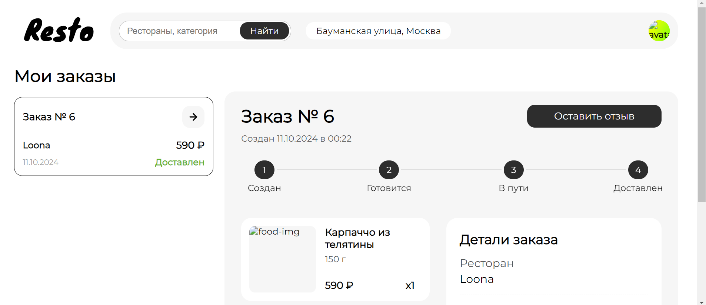
1. Если заказов нет - выведется "У вас нет заказов"
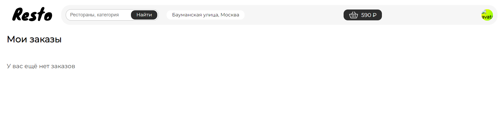
2. Нажать на стрелочку на карточке заказа - появится информация о нем
3. Нажать на кнопку "Оставить отзыв" - появится модальное окно для добавления отзыва и оценки
4. Нажать на звезду, нажать на кнопку "Отправить" - окно пропадет, появится сообщение, что отзыв оставлен
5. Нажать на звезду -> ввести отзыв -> нажать на кнопку "Отправить" - окно пропадет, появится сообщение, что отзыв оставлен
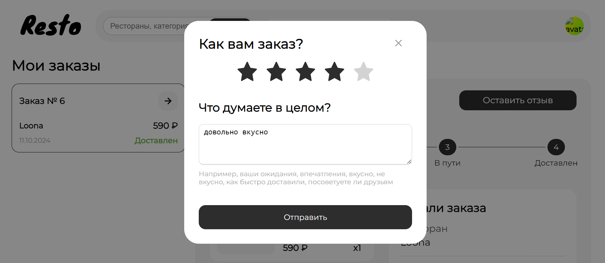

## 7. Профиль
[Профиль](https://resto-go.site/profile) 
_Позитивные тесты_ 

1. Изменить поле почты, имени, нажать на кнопку "Сохранить" - данные будут изменены
2. Ввести номер телефона, нажать на кнопку "Сохранить" - данные будут сохранены
3. Нажать на аватарку, выбрать файл, нажать на кнопку "Сохранить" - установится новая аватарка
4. Ввести старый пароль, новый, повторить новый нажать "Сохранить" - появится сообщение о смене пароля

_Негативные тесты_ 
1. Ввести почту без собачки - вывод сообщения с требованием к этому полю
2. Ввести почту без домена - вывод сообщения с требованием к этому полю
3. Ввести почту без имени ящика - вывод сообщения с требованием к этому полю
4. Ввести имя из одной буквы - отобразятся требования к имени
5. Ввести имя больше, чем из 19 букв - отобразятся требования к имени
6. Загрузить фото больше 10Мб - вывод сообщения о необходимом размере изображения
7. При вводе номера телефона ввод букв не допускается
8. При вводе номера телефона ввод больше 11 цифр не допускается
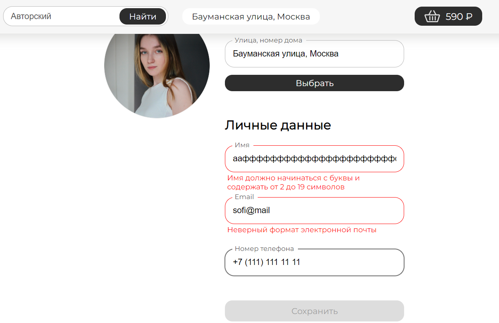
9. Ввести старый пароль, новый, ввести не новый - появится сообщение о несовпадении паролей
10. Ввести старый пароль, в поле для нового ввести старый - появится сообщение, что старый и новый пароли не должны совпадать

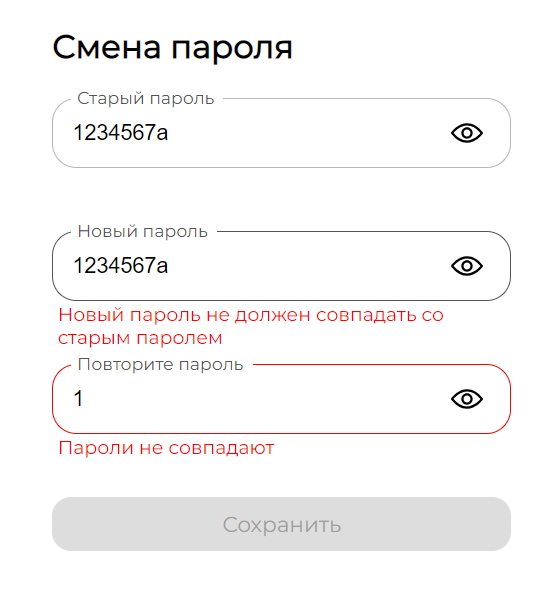

## 8. Браузерная навигация
[Главная страница](https://resto-go.site/restaurants) 
1. Нажать на карточку ресторана Горыныч -> нажать на кнопку "Добавить" у блюда -> нажать на кнопку корзины в верхней панели -> нажать на браузерную кнопку `<-` - редирект на страницу ресторана Горыныч
2. Нажать на карточку ресторана Горыныч -> нажать на кнопку "Добавить" у блюда -> нажать на кнопку корзины в верхней панели -> нажать на браузерную кнопку `<-` -> нажать на браузерную кнопку `->` - редирект на страницу корзины
